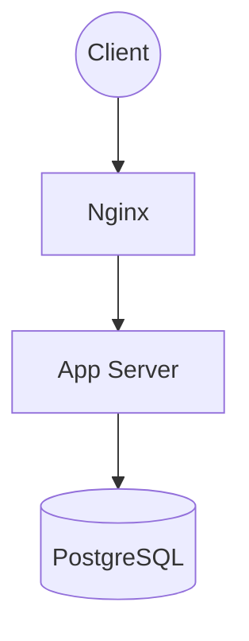
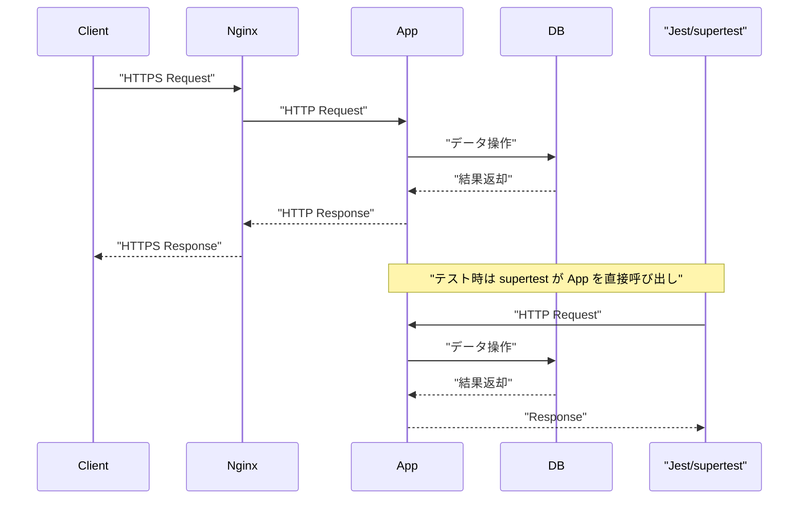

# Todo API

本プロジェクトは、タスク管理機能を提供するAPIサーバーです。バックエンドのみの実装で、認証機能やタスクのCRUD操作をサポートしています。

## API仕様
| メソッド | エンドポイント | 機能 | 認証 |
| :--- | :--- | :--- | :--- |
| POST | /auth/signup | ユーザー登録 | 不要 |
| POST | /auth/signin | ログイン | 不要 |
| POST | /tasks | タスク作成 | 必要 |
| GET | /tasks | タスク一覧取得 | 必要 |
| GET | /tasks/:id | タスク詳細取得 | 必要 |
| PATCH | /tasks/:id | タスク更新 | 必要 |
| DELETE | /tasks/:id | タスク削除 | 必要 |

### API利用例 (タスク作成)
```bash
curl -X POST https://localhost/api/tasks \
  -H "Authorization: Bearer <JWT_TOKEN>" \
  -H "Content-Type: application/json" \
  -d '{
    "title": "タスクのタイトル",
    "description": "タスクの詳細"
  }' -k
```

## 技術スタック
- **Language**: TypeScript (latest)
- **Runtime**: Node.js v22 LTS
- **Framework**: Express
- **Database**: PostgreSQL 16
- **ORM**: Prisma 7.8
- **Container**: Docker, Docker Compose
- **Testing**: Jest, supertest
- **CI/CD**: GitHub Actions(ci.yml)

## システム構成
### Docker構成図



### 全体の処理フロー



## 工夫した点
- **セキュリティ**: Nginxをリバースプロキシとして配置し、HTTPS通信。
- **型安全性**: TypeScriptの厳格な設定とZodによるリクエストバリデーション。
- **開発環境**: Docker Composeにより、データベースを含む環境をコマンド一つで構築。
- **保守性**: Prismaによる型安全なデータベース操作と、責務を分離したアーキテクチャ（Controller/Service/Route）。

## ローカル起動手順 ※ <a href="https://drive.google.com/file/d/1_KEgoKxul5ohidJfv0C8d4lPuvAQlqwt/view" target="_blank" rel="noopener noreferrer">🎦動画あり (ローカル起動・テスト)</a>

1. **githubからダウンロード**
   ```bash
   git clone https://github.com/nan0111/todo-node-api.git
   cd todo-node-api
   ```

2. **環境変数の設定**
   `.env.example` を `.env` にコピーしてください。
   - `DATABASE_URL`: PostgreSQLの接続URL
   - `JWT_SECRET`: JWT署名用シークレットキー
   ```bash
   cp .env.example .env
   ```

3. **コンテナの起動**
   ```bash
   docker compose up --build -d
   ```

## ローカルテスト手順
1. **コンテナの起動**
   ```bash
   docker compose up --build -d
   ```

2. **テスト実行**
   ```bash
   docker compose exec -T app npm test
   ```

## ディレクトリ構成
```text
.
├── nginx/        # リバースプロキシ設定
├── prisma/       # DBスキーマ・マイグレーション
├── src/          # アプリケーションソースコード
│   ├── controllers/  # リクエスト処理
│   ├── services/     # ビジネスロジック
│   ├── routes/       # ルーティング定義
│   ├── middlewares/  # 認証・バリデーション等
│   ├── config/       # 設定ファイル
│   └── types/        # 型定義
└── tests/        # テストコード
```

## ライセンス
MIT License
